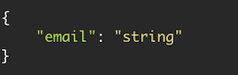

# Server

> Talent Path Pipeline Back-end

## Table of Contents

[TOC]

## Getting Started

The following setup will be broken down into two sections, setting it up for local development and setting it up for deployment on [heroku](https://www.heroku.com).

### Setting up for local development

1. Clone the repo to your machine

2. Run the following command `npm i` to install all packages

3. Create a .env file on the root directory with the information from .env.default file

4. Have [Postgress running](https://www.postgresql.org/docs/current/server-start.html) in the background.

5. Run `npm start` to run the server

6. Sequelize will generate all the tables for Postgress before the server begins listening for requests.

### Setting up for deployment

**Coming Soon!**

## Coding Standards

### Naming conventions:

- **Classes/Components**: Pascal case (e.g. `HomePage.js`)
- **Variables**: Snake case (e.g. `my_awesome_variable = 5`)
- **Constants**: Caps case (e.g. `const GLOBAL_VARIABLE = 'a global string`)
- **Folders**: Kebab case (e.g. `i-am-a-folder`)
- **Functions**: Camel Case (e.g. `doSomethingPlease(input)`)
- **Git Branches**: Kebab case with a descriptive name and prefaced by an 's' the number of the issue it deals with (e.g. for `server issue #11: "AaD, I want to create associations between tables` the branch should be named something like `s11-table-associations`).

### Style consistency

We are using VSCode for development with the ESLint and Prettier extensions for consistency. Configuration files for both extensions are included in the root of this repository. If contributing, please either install those extensions or read through them and ensure your code complies with the rules listed.

## Basic Structure

The back-end is structure like the following:

```text
server/
├── config/
│   └── config.js
├── controller/
├── db/
├── middleware/
├── models/
│   ├── authentication/
│   ├── index.js
│   ├── learning-resources/
│   └── user-resources/
├── package.json
├── package-lock.json
├── README.md
├── routes/
│   ├── index.js
│   ├── private/
│   └── public/
├── server.js
├── services/
├── utils/
└── validations/
```

**Descriptions coming soon!**

## Usage

### Routes to use

1. **Registration**

   -  **/api/user** - Create user

     - **Parameters**

       | Name                                                         | Description                                                  |
       | ------------------------------------------------------------ | ------------------------------------------------------------ |
       | **body**  | Created user object                                          |
       | (body)                                                       | Example                                                      |
       |                                                              |  <br><br> Parameter content type: **application/json** |
       | **Response**                                                 | Parameter content type: **application/json**                 |
       | **Code**                                                     | **Description**                                              |
       | 200                                                          | ``successful operation``                                     |
       | 400                                                          | ``Invalid username or password supplied``                    |
       
     
   -  **/api/user/login** - Logs user into the system 

     - **Parameters**

       | Name                                                         | Description                                                  |
       | ------------------------------------------------------------ | ------------------------------------------------------------ |
       | **body**  | Logs a user in                                               |
       | (body)                                                       | Example                                                      |
       |                                                              | <br> Parameter content type: **application/json** |
       | **Response**                                                 | Parameter content type: **application/json**                 |
       | **Code**                                                     | **Description**                                              |
       | 200                                                          | ``successful operation``                                     |
       |                                                              | **Headers:**<br><br>**X-Token**: User JWT token **(string)** |
       | 400                                                          | ``Invalid username or password supplied``                    |

 2. **Read**

   -  **/api/user** - Get user(s)

     - **Parameters**

       | Name                                                         | Description                                                  |
       | ------------------------------------------------------------ | ------------------------------------------------------------ |
       | **body**  | Email of User you want to get       |
       | (body)                                                       | Example                                                      |
       |                                                              |  <br><br> Parameter content type: **application/json** |
       | **Response**                                                 | Parameter content type: **application/json**                 |
       | **Code**                                                     | **Description**                                              |
       | 200                                                          | ``successful operation``                                     |
       | 400                                                          | ``An error has occurred: Invalid data received.``                    |
       
           